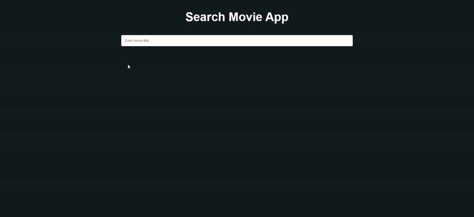

Description: Application made to search movies on IMDB database. You can press on movie poster and get more details on selected movie.

Technologies used: ReactJS, REST API, Axios, Html, Css.

How to start: run "npm run start" command.